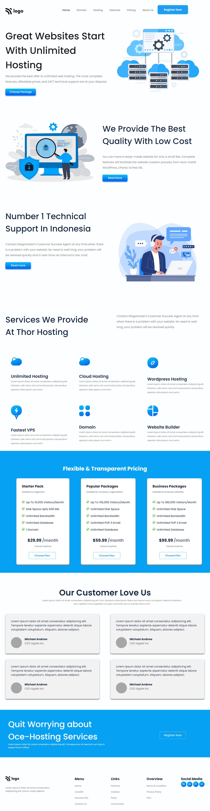

# Hosting Landing Page

# LIVE LINK

[Click Here to visit Hosting Landing Page](https://ankush-hosting-landing-page.netlify.app/)

---

# Developed By: `Ankush Thakur`

## Technology Used

- HTML
- CSS

---

## Additional Stuff
- Learned about Animation and Implemented it on Hover

---

## Concept Learned
- Learn how to structure the CSS
- Learn how to reduce the repetive CSS
- Learned about grid
- Learned about Animation 
- Learned about Box Shadow
- Learned about Smoothness
- Learned how to Structure the web page so, that CSS could be minimal
---

# Screenshot of Project

## Time Taken to Complete the Project
>  DEVELOPMENT TIME: 10 hour

` TOTAL TIME : 3 days, in which I have learned about Animations and also impletemented it on hover effect`